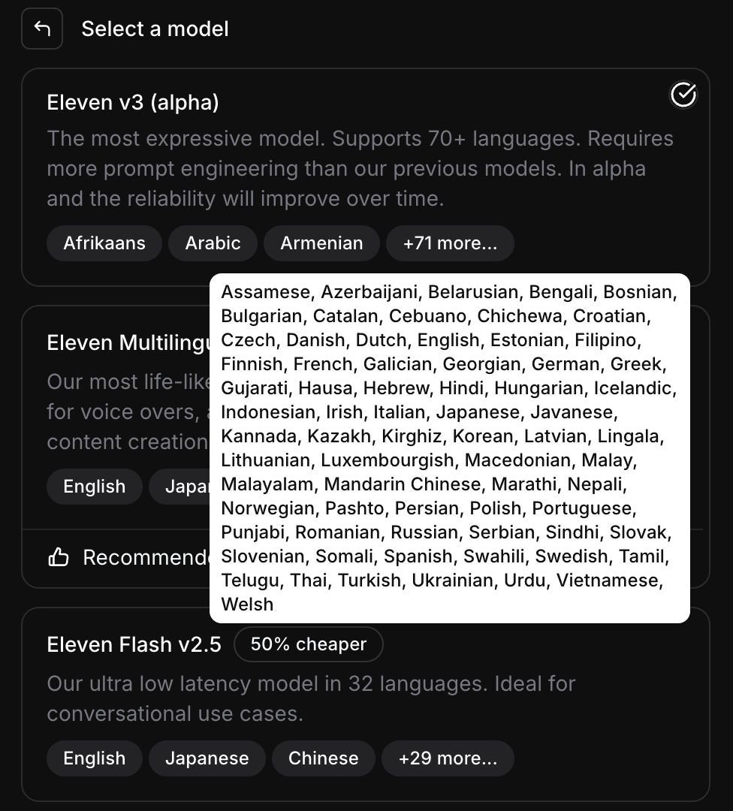

agent = თუ გსურთ ზარების ავტომატიზაცია, ხელოვნური ინტელექტის აგენტი ხელსაწყოებით რომელიც საშუალებას აძლევენ გარემოსთან იმუშაონ მაგალითად ექსელი გამოიყენონ, ზარებს უპასუხონ და ა.შ

Creative = თუ გსურთ ვიდეოს გახმოვანება ან ნებისმიერი კრეატიული მიზნისთვის გენერირება. 

11labs არა ერთი კონკრეტული ხელოვნური ინტელექტი, არამედ მათი პროვაიდერია, ყავთ როგორც საკუთარი ასევე სხვების მიერ მოწოდებული მოდელები. ქართული ხმის გენერირება მხოლოდ Eleven V3 Alpha-ს შეუძლია ამჟამად. 
თქვენი ხმის კლონირებისთვის გჭირდებათ მინიმუმ 5 დოლარიანი basic გამოწერა

11 labs საშუალებას გაძლევთ რომ დაანერიროთ აუდიო როგორც უბრალო ტექსტი, ისევე მუსიკა. დაკლონოთ თქვენი ხმა ან შექმნათ ახალი ხმა მხოლოდ პრომპტის საშუალებით.

როდესაც ტექსტის გენერაციას დაიწყებთ, ჩასვით ემოციები კვადრატულ ფრჩხილებში ინგლისურად [laugh]

