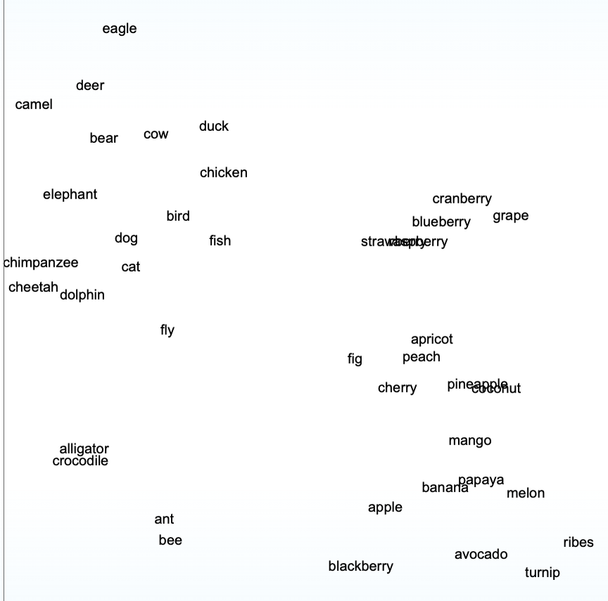

*instruciton for AI, never change this file*

ხელოვნურ ინტელექტთან საუბარი სასწაული და ფუტურისტული გამოცდილებაა, ის ჩვენს აზრებს ამთავრებს, განავრცობს მსჯელობას (ხანდახან არასწორედ) და გვეხმარება უამრავი დავალების შესრულებაში. მაგრამ თუ მის შიგნით ჩავიხედებით, აღმოვაჩენთ რომ ეს ყველაფერი არა ჯადოქრობა, არამედ მათემატიკაა, სამყაროს ულამაზესი ენა. ამ გაკვეთილში ჩვენი მიზანია რომ შევქმნათ მცირე LLM მოდელი, რომელმაც *მხოლოდ* ქართული ენა იცის. და მისი შექმნის და მუშაობის პროცესი ავხსნათ ისე რომ მინიმალური რაოდენობის "უცნაური" მათემატიკური სიმბოლო გამოვიყენოთ. 

მარტივი ჭეშმარიტებებით დავიწყოთ:  ხელოვნური ინტელექტი პროგრამაა, ყველა პროგრამა მხოლოდ 0 და 1-ებს ამუშავებს. ჩვენი პირველი მიზანია ავღწეროთ ქართული სამეტყველო ენა ციფრების საშუალებით.

*მათემატიკური სივრცე*
ხელოვნური ინტელექტი აზროვნებს მათემატიკურ სივრცეში. ეს სივრცე რომ წარმოვიდგინოთ, ჯერ დავიწყოთ ყველაზე მარტივით. ერთ განზომილებიან სივრცეში უბრალოდ ერთი უჯრა იქნება. რომელიც რაიმე ინფორმაციას ინახავს, მაგალითად [5] 

სკოლის პროგრამიდან ალბათ ბევრს გახსოვთ რა არის ვექტორი.მას რაღაცა სიდიდე და მიმართულება გააჩნია. ამ კონტექსტში შეგიძლიათ ვექტორი წარმოიდგინოთ როგორც რიცხვების სია რომელსაც მიმართულება აქვს ჰორიზონტალური -  [1,3,5,665] ან
ვერტიკალური-  [
    1,
    4,
    8,
    10
]

ერთი განზომილებით მაღლა რომ ავიდეთ მატრიცას დავინახავთ. ვექტორი 1 განზომილებაა, როგორც ხაზი რომელსაც სიგრძე გააჩნია, მატრიცა 2 განზომილებაა, როგორც მართკუთხედი სიგრძით და სიმაღლით.
[1,2]
[1,3] 
ერთი განზომილებით მაღლა რომ ავიდეთ კი დავინახავთ ტენსორს. 

რომელსაც უკვე 3 განზომილება აქვს და სამივე განზომილებაში, თითოეულ უჯრაში ინფორმაციის ჩაწერა შეიძლება. ტენსორებს შეიძლება მეოთხე, მეხუთე და მეათასე განზომილებაც ქონდეთ, მათი წარმოდგენა ადამიანისთვის შეუძლებელია, რადგან ჩვენი ტვინი 3 განზომილებიან სივრცესთან არის ადაპტირებული, ეს დამატებითი სივრცეები მათემატიკაში არსებობს. 

ხელოვნური ინტელექტისთვის სიტყვები და მნიშვნელობები ასეთ სივრცეშია მოთავსებული, აქ თითოეული სიტყვა ციფრების მიმდევრობაა და მიმართულებაა ასოების ნაცვლად, მაგალითად:

ეს ჯიპიტი 3-ის მცირე ნაწილის გამარტივებული ვიზუალიზაციაა. როგორც ხედავთ ზოგი სიტყვა ახლოა ერთმანეთთან ზოგი შორს, რატომ და რა განსაზღვრავს ამ სიტყვების ადგილმდებაორეობას და მიმართულებას? კონტექსტი! 
ხელოვნური ინტელექტი ყურადღებას აქცევს სიტყვების გარშემო წინადადებებს, მაგალითად "ალიგატორი" და "ნიანგი" მიახლოებით მსგავს წინადადებებში შეგვხვდება, ამიტომ ისინი უფრო ახლოს იქნებია ვიდრე "ავოკადო" და "აქლემი".

ხელოვნური ინტელექტი ასეთ მათემატიკურ სივრცეებში ამუშავებს ინფორმაციას. ოღონდ ერთი ნიუანსით, ჯიპიტი 3.5 (ძველი მოდელი)ინფორმაციას 12 288 განზომილებიან ვექტორებში აღიქვამს, უფრო თანამედროვე და ძლიერ deepseek v3 -ს კი აქვს 7 000 განზომილებიანი სივრცე, მაგრამ 16 000  განზომილებამდე ადის თუ იმ ვექტორებს ჩავთვლით რომელთაც იყენებს რომ მიხვდეს, ტექსტის რა ნაწილი რომელს უკავშირდება.

როგორც ვთქვით ვექტორი არის როგორც ასე რომ ვთქვათ რიცხვეის ხაზი, როდესაც ხელოვნურ ინტელექტი ინფორმაციას ამუშავებს, ჯერ ჩვენი ტექსტი ამ ვექტორებად უნდა ვაქციოთ, როგორც გახსოვთ კომპიუტერებს მხოლოდ 0-ების და 1-ების გადამუშავება შეუძლია, შესაბამისად ნებისმიერ ტექსტს ჯერ რიცხვებად ვაქცევთ. 

როგორ ავღწეროთ სამეტყველო ენა ციფრების საშუალებით? მოდით რამდენიმე ნათელი მაგალითი განვიხილოთ:
1) ავიღოთ 33 ასო მივანიჭოთ თითოეულ მათგანს ნომერი 1-დან 33-მდე და ვნახოთ რა სიხშირით მოსდევენ ისინი ერთმანეთს: 
*(აქ კამათელი უნდა დავაგენერირო 33 ასოთი, მხარის სიდიდე დამოკიდებულია ასოს სიხშირიზე)*
დავითვალოთ საშუალოდ რამდენი ასოსგან შედგება სიტყვა
*(გამოვითვალო clean_ge.json-დან და კამათელი გავაკეთო დისტრიბუციის შუაში)*
და გავაგოროთ ორი კამათელი ჯერ სიტყვის ხანგრძილოვობისთვის მაგალითად 2 და შემდგომ 3ჯერ გავაგოროთ ასოების 33 მხრიანი კამათელი.
ეს მეთოდი დაგევხმარებოდა რომ ქართული ენის მსგავსი ჟღერადობის სიტყვები შევქმნათ, ზოგჯერ შეიძლება გაგვიმართლოს თუ სიტყვის ხანგრძილობა 2 და ასოები დ-ა ამოვა, მაგრამ სამეტყველო ენა ბევრად უფრო კომპლექსურია ვიდრე ასოების ბანალური თანმიმდევრობა, ჩვენ გვაქვს სიტყვის ფუძე, კონტექსტი, სასვენი ნიშნები უამრავი დამატებითი ინფორმაცია რაც გვააზრებინებს რა სიტყვას რომელი უნდა მოსდევდეს. 

ამასთანავე ამ მიდგომას ერთი სერიოზული ნაკლი აქვს, ასო ჰ უფრო იშვიათად გვხდება სიტყვის ბოლოში ვიდრე სიტყვის დასაწყისში ან შუაში, შესაბამისად თითოეული ასოს კამათელის გაგორების შემდეგ კამათლის ფორმა უნდა შეიცვალოს. 

*საინტერესოა მარკოვის ჯაჭვები მარა ამ კურისისთვის მგონი პერებოი, მხოლოდ იმის დასამტკიცებლად რომ "ი"-ს მერე "ა" ხშირად მოდის მაგდენი ტვინის #$#@ არ ღირს :დდ*
სამეტყველო ენის მათემატიკურად აღწერა ჯერ კიდევ მe-20-ე საუკუნის დასაწყისში რუსმა მათემატიკოსმა ანდრეი მარკოვმა ცადა. მისი ნაშრომი უფრო თავისუფალი ნების არსებობას ეხება, ვიდრე ხელოვნურ ინტელექტს და ენის მოდელირებას, მის მიერ 1906 დაწერილი ნაშრომი " звѣстія Физико-математического общества при Казанском университете" უამრავ დეტალს შეიცავს, ამიტომ ჩვენი გაკვეთილის მიზნებიდან გამომდინარე მხოლოდ ერთ ნაწილს მარკოვის ჯაჭვებს შევეხებით. "მარკოვის ჯაჭვი" - მათემატიკური პროცესია. ახსნის ნაცვლად მოდით უბრალოდ გავიმეოროთ ის. 

ქართული ენა დავყოთ არა 33 ასოდ, არამედ მხოლოდ ხმოვნების და თანხმოვნების ჯგუფებად.

თ - თანხმოვანი(33 - (ა,ე,ი,ო,უ) :D )
ხ - ხმოვანი = (ა,ე,ი,ო,უ)

იმისათვის რომ განგრძობითი ჯაჭვის შექმნა შევძლოთ, 

GPT მოდელები ტექსტს არა სიტყვებად ან ასოებად, არამედ ტოკენებად აღიქვამენ, ტოკენი სიტყვის ნაწილია რომელიც ტექსტში ხშირად გვხვდება. მაგალითად წინადადება: "ხინკალი მენატრება",  "ხინკალი" შეიძლება 2 ტოკენი იყოს:  "ხინ"-"კალი" ხოლო "მენატრება" 1. ეს ტოკენები სიმბოლოებია და მათზე მათემატიკურ გამოთვლებს ვერ შევასრულებთ, ამიტომ თითოეულ ტოკენზე მიმაგრებულია ვექტორი, რიცხვების სია, რომელიც მათემატიკურ სივრცეში შეიძლება "ჩავსვათ" რათა გამოთვლები ჩავატაროთ. მაგალითად სიტყვა მენატრება, შეიძლება გადაიქცეს 256 რიცხვიან ვექტორად:
0.12, -0.44, 0.03, …, 0.77...
ეს რიცხვები არის „კოორდინატები“ მათემატიკურ სივრცეში.
საინტერესო ისაა რომ მსგავსი მნიშვნელობის სიტყვები ამ სივრცეში ახლოს დგანან, მაგალითად "დედა" და "მამა" ამ სივრცეში უფრო ახლოს იქნებიან ვიდრე "დედა" და "მატარებელი". 

კიდევ საინტერესო ფაქტი ამ მათემატიკურ სივრცეზე: თუ მაგალითად სიტყვა "დედა"-ს ვექტორს, გამოვაკლებთ "მამას" კოორდინატებს რომ მათ შორის დაშორება გავიგოთ და დაშორებით გადავაადგილდებით სიტყვიდან "დედოფალი" ახლოს მივალთ სიტყვასთან "მეფე"

ტოკენები შეგვიძლია შევადაროთ ლეგოს ფიგურებს, ზოგი დამოუკიდებლად არაფერის ნიშნავს როგორც პრიმიტიული აგური, ზოგს მეტი მნიშნველობა აქვს, როგორც ლეგო კაცის თავს ან მანქანის ნაწილს, მაგრამ  რაიმე შინაარსიანის შესაქმნელად, მათი კომბინაციაა საჭირო. ესაა როგორც ანბანი ხელოვნური ინტელექტისთვის რომ სამეტყველო ენა მათემატიკურ ფორმებად აქციოს.

ChatGPT ისევე როგორც Deepseek არიან LLM მოდელები. LLM იშიფრება როგორც Large Language Model, რაც ითარგმნება როგორც "დიდი ენობრივი მოდელი", მის გასაწრთვნელად ძალიან დიდი რაოდენობის ტექსტია გადამუშავებული. მაგალითს რომ მივყვეთ და ჩვენი მცირე მოდელი შევქმნათ, ჯერ დიდი რაოდენობის ქართული ტექსტი უნდა მოვიძიოთ. 

რადგან ხელოვნური ინტელექტის გაწრთვნას Macbook Air M3-ზე ვაპირებ, ახალი მოაზროვნე მოდელის შექმნის იმედი არ მაქვს, ამ ფაილის მიზანი განათლებაა. თუ ჩატჯიპიტი და დიდი მოდელები მთლიან ინტერნეტის დასკანერებით და წარმოუდგნელად დიდი რაოდენობის ტექსტით არიან გაწრთვნილები, ჩემი მიზანი რამდენიმე ასეული მეგაბაიტი ტექსტი იქნება. გაითვალისწინეთ რომ ტექსტი საკმაოდ "მსუბუქი" შესანახია, 2024 წლის მონაცემებით მთლიანი ვიკიპედიის ტექსტი სულ 24 გიგაბაიტს იწონის და უმეტესობა თანამედროვე ტელეფონზე დაეტევა, ამიტომ რამდენიმე ასეული მეგაბაიტი ტექსტიც კი, ძალიან ბევრი ინფორმაციაა ადამიანისთვის. 

ხელოვნური ინტელექტის სიმძლავრე დამოკიდებულია არა მხოლოდ მათემატიკური ველის სიდიდიზე და გამოთვლის სიჩქარაზე, არამედ სასწავლო მასალის სიზუსტეზე, რაოდენობაზე და სისუფთავაზე. იმისათვის რომ ხელოვნურმა ინტელექტმა ენა ისწავლოს, მან ბევრი ტექსტი და პატერნები უნდა ნახოს, თუ ჩვენ მიერ მოგროვებული ტექსტი გრამატიკული შეცდომებითაა სავსე, AI არასწორ პატერნს ისწავლის. რაც უფრო მრავალფეროვანი ტექსტი გვაქვს, მით უკეთ სწავლობს ენის მახასიათებლებს. მარტივად რომ ვთქვა მჭირდება როგორც ვიკიპედიის არტიკლები, ისე წიგნები, დიალოგები. პირველ რიგში ინტერნეტში ქართული pdf წიგნები მოვიძიე, მარტივი პითონის სკრიპტით იქიდან ტექსტი დავაკოპირე და რამდენიმე ასეული წიგნი ერთ 131 მეგაბაიტიან "წიგნები.txt" ვაქციე. ტექსტი ჯერ კიდევ არეული და გასასუფთავებელია, სანამ გასუფთავებას დავიწყებ, მეტი ტექსტის მოსაგროვებლად, ვიკიპედიას მივადგები: 145 მეგაბაიტი მაქედან და შედარებისთვის ვეფხისტყაოსანი, რომელიც 913 კილობაიტს იწონის.

corpus/geowiki_fixed.txt
corpus/წიგნები.txt
corpus/ვეფხისტყაოსანი.txt

სასწავლო კორპუსი: 133.5 MB + 145.2 MB = 278.7 MB
278.7 × 1024 = 285388.8 
285388.8 / 913 = 312.5 ვეფხისტყაოსანი რომ წარმოიდგინოთ მაგ რაოდენობის ტექსტზე ვწრთვნით, რაც ერთი შეხედვით ბევრი ჩანს, მაგრამ მხოლოდ ადამიანისთვის, რეალურად გამოსადეგი და მოაზროვნე მოდელის შესაქმნელად, ბევრად მეტი ტექსტი, რთული არქიტექტურა და ძლიერი კომპიუტერი გვჭირდება. ამიტომ ჩვენი მიზანია ვცადოთ ისეთი მოდელის შექმნა, რომელსაც მცირე წინადადების აწყობა, ფაქტობრივად ენის იმიტაცია შეუძლია და არა რთული მსჯელობა როგორც ჩატჯიპიტის. 

278 მეგაბაიტ არეულ ტექსტს, ბევრად ჯობია რომ ნაკლები იყოს, მაგრამ უფრო დალაგებული. რადგან მაგდენის წამკითხველი მთელი ცხოვრება არ ვარ, (51 მილიონი ასოა), ტექსტის გასაწმენადად და დასალაგებლად python-ს გამოვიყენებ. პროგრამას კი ჩატჯიპიტით დავწერ. 

=== კორპუსის სტატისტიკა ===

ჯამში ასოები: 60,929,276
ასოების საშუალო რაოდენობა ერთ {}-ში: 1978.1
ტოპ 50 სიმბოლო სიხშირის მიხედვით.
'ა': 7,700,326
' ': 7,029,972
'ი': 5,545,831
'ე': 4,358,713
'ს': 3,027,570
'რ': 2,939,064
'მ': 2,818,072
'ო': 2,514,830
'დ': 2,426,277
'ლ': 2,074,062
'ნ': 2,070,221
'ვ': 1,945,392
'ბ': 1,612,773
'უ': 1,320,608
'თ': 1,304,389
'გ': 1,152,932
'U+000A': 1,069,969 / ხაზის დამთავრების სიმბოლოა, ტექსტიდან ამოვიღე
',': 950,129
'ხ': 863,381
'ტ': 786,608
'შ': 757,936
'ც': 718,526
'კ': 688,534
'.': 625,169
'ქ': 486,885
'ყ': 438,410
'წ': 434,457
'ფ': 385,157
'ზ': 367,434
'ღ': 294,317
'ჩ': 274,909
'პ': 271,376
'ძ': 233,441
'-': 221,537
'ჯ': 105,687
'ჰ': 104,810
'ჭ': 96,776
'!': 80,560
'1': 80,512
'?': 67,438
'—': 66,821
'ჟ': 61,295
'0': 54,165
'9': 48,265
':': 46,196
'2': 44,864
')': 44,624
'(': 44,574
'"': 40,929
'…': 34,720

ახლა ამ ტექსტის შესაბამისი ტოკენები უნდა ვიპოვოთ. ამისათვის გამოვიყენებთ SentencePiece.ის არ ეყრდნობა ხელით დაწერილ წესებს, სწავლობს თვითონ სტატისტიკურად რომელი ასო რომლის შემდეგ მოდის ხშირად და რა სიხშირეებით, შემდგომ კი მათ ჯგუფებად ყოფს და ამ ჯგუფების სიხშირეს ითვლის. 

რა ხდება შიგნით?
SentancePiece-ის მიზანია შექმნას 32 000 "ლეგოს ფიგურა" რომლითაც მთლიანი ტექსტის დაწერა რაც შეიძლება ეფექტურად იქნება შესაძლებელი. ისეთი 32 000 ფიგურა უნდა იპოვოს, რომ მთლიანი ტექსტის ასაკრეფად, რაც შეიძლება ნაკლები ლეგო გამოიყენოს. მაგალითად სიტყვა "და" ხშირად გვხვდება ტექსტში. ის შეიძლება აღიწეროს ან ორი ტოკენით "დ" "ა" ან ერთი ტოკენით "და", ჩვენი მიზანია, რაც შეიძლება ბევრი კომბინაცია ვიპოვოთ, რომელიც ხშირად გვხვდება.

რატომ არ ვიყენებთ მთლიან სიტყვებს?
იმიტომ რომ ქართული მორფოლოგია მდიდარია. სიტყვების პრეფიქსები და სუფიქსები მთლიან მნიშნვნელობებს ცვლიან. 
მაგალითად ტოკენი ფუძით "საქართველო" 5-ჯერ გვხვდება
სრული ტოკენების სია იხილეთ: "tokens/ge_tokenizer.vocab"
▁საქართველოს	-7.80465
▁საქართველოში	-9.29392
▁საქართველო	-9.69134
საქართველო	-11.8825
▁საქართველოდან	-12.0478

ქვედატირე ცარიელ სივრცეს ნიშნავს, სიტყვის მარჯვენა რიცხვი კი აჩვენებს თუ რამდენად ხშირად და სასარგებლოდ გამოიყენება ტოკენი ტექსტში. ეს რიცხვი ითვლება ნეგატიურ ლოგარითმში (log_e), ანუ რაც უფრო მცირეა რიცხვი -> უფრო ხშირია ტოკენი.

ახლა ჩვენი მიზანია ხელოვნურ ინტელექტი გავწრთვნათ. უკვე გავიგეთ როგორ შლის და აღიქვამს ტექსტს, მაგრამ როგორ ამუშავებს მას?

იმისათვის რომ თანამედროვე ხელოვნური ინტელექტის მუშაობის პრინციპი გავიგოთ აუციებელია ვიცოდეთ რა არის ტრანსფორმერი. 

ტრანსფორმერი ნეირონული ქსელის არქიტექტურაა, რომელმაც შეცვალა მსოფლიო 2017 წელს ნაშრომში "“Attention is All You Need”" 
და მას შემდეგ გახდა llm-ის საყრდენი. ამ არქიტექტურას ეყრდნობა ისეთი მოდელები როგორიცაა ChatGPT, Llama, Gemini, DeepSeek და მისი გამოყენება ტექსტზე არ მთავრდება, ასევე იყენებენ აუდიო გენერაციაში, სურათების ამოცნობაში, პროტეინის 3დ სტრუქტურის პროგნოზში და ა.შ

ტექსტ გენერაციული ტრანსფორმერების მთავარი პრინციპია შემდეგი სიტყვის პროგნოზი. როდესაც მომწმერებელი დაწერს პრომპტს, მოდელი ცდილობს იპოვოს მაგ ტექსტის ყველაზე მოსალოდნელი გაგრძლეება. ამ არქიტექტურის მთავარი უპირატესობა მისი "ყურადღების" უნარია, რომელიც საშუალებას აძლევს მოდელს ერთდროულად გაანალიზოს მთელი წინადადება და დაინახოს სხვადასხვა ტოკენები ერთმანეთს როგორ უკავშირდებიან. ტრანსოფრმერი შედგება 3 ძირითადი კომპონენტისგან:
1. Embedding - გუგლ თრანსლეითი თარგმნის როგორც "ჩასმას" რაც მთლად არასოწრი არაა, 
2. Transformer Block - ტრანფორმერის ბლოკი
    შედგება ორი ნაწილისგან. დაგპირდით რომ რთულ მათემატიკას არ გამოვიყენებდით, მაგრამ მას რომ თავი საერთოდ ავარიდოთ: 
    ATTENTION არის ინფორმაციის გადაცემა ტოკენებს შორის, ანუ ვინ ვის უნდა მოუსმინოს
    MLP არის ინფორმაციის დამუშავება თითოეულ ტოკენში, ასე რომ ტრანსფორმერის ბლოკი მოქმედებს როგორც კონტექსტის აგებისა და გამდიდრების ერთეული. 
    
3. Output Probabilities - რა სიტყვა/ტოკენია მოსალოდნელი ტექსტის გაგრძელეისას? მაგალითად სიტყვას "ვაშლი" შეიძლება მოყვებოდეს "ხეზე" ან "მოწყვიტე", ხელოვნური ინტელექტი ორივეს სიტყვას ალბათობას ანიჭებს. 

ჩვენი ხელოვნური ინტელექტიც ტრანფორმერების არქიტექტურას გაიმეორებს თუმცა მარტივს რათა კომპიუტერი არ გადავწვა. 

სანამ წრთვნას შევუდგებით ჯერ უნდა გავიგოთ, რა არის ეს წრთვნა და რეალურად როგორ მუშაობს?

ხელოვნურ ინტელექტს აქვს "პარამეტრები" ეს უბრალოდ რიცხვებია, რომელზე ტოკენის მნიშვნელობებს ამრავლებს რათა შემდეგი ტოკენის ალბათობა გამოთვალოს. დიდ მოდელებს აქვს მილიონობით და მილიარდობით ასეთი პარამეტრი, მაგალითად chatGPT 4o-ს 200 მილიარდი პარამეტრი აქვს ერთ-ერთი მაიკროსოფტის სამეცნიერო სტატიის მიხედვით:
https://arxiv.org/pdf/2412.19260v1

სწავლის პროცესისას, ხელოვნურ ინტელექტს რომელსაც პარამეტრები შემთხვევითობის პრინციპით აქვს შერჩეული ვაჩვენებთ წინადადებას კორპუსიდან მაგალითად:
"საბედნიეროდ, იმ საბედისწერო საღამოს მელანია შინ " ხელოვნურმა ინტელექტმა უნდა გამოიცნოს როგორ მთავრდება წინადადება,  თუ სწორად გამოიცნო რომ მელანია „შინ დარჩა“, პარამეტრები უცვლელად რჩება. მაგრამ თუ შეცდა და რაღაც აბსურდი თქვა, მოდელი ამას „სჯის“ მათემატიკური ფუნქციით რომელსაც loss function ეწოდება. ეს ფუნქცია ზომავს, რამდენად შორს იყო პასუხი რეალური სწორი გაგრძელებისგან. 

როცა მოდელი შეცდება, მაგალითად წინადადება უნდა დამთავრებულიყო „მელანია შინ დარჩა“, მაგრამ მან დაწერა „მელანია მთვარეზე გაფრინდა“, ჩნდება შეცდომის მაჩვენებელი (loss). ეს არის რიცხვი, რომელიც გვიჩვენებს, რამდენად შორსაა ჩვენი პასუხი სწორისგან. რაც უფრო დიდია ეს რიცხვი, მით უარესია მოდელის სწავლა.

ახლა წარმოვიდგინოთ ამ შეცდომის ყველა შესაძლო მნიშვნელობა, ყველა პარამეტრის კომბინაციისთვის. მივიღებთ უზარმაზარ ლანდშაფტს მრავალგანზომილებიან ველს. თითოეული წერტილი ამ ველში არის კონკრეტული პარამეტრების ნაკრები, სიმაღლე კი აღნიშნავს შეცდომას. ხელოვნური ინტელექტი წრთვნის პროცესში ხედავს თუ რომელ მხარეს იხრება ყველაზე მეტად ეს რელიეფი და ცდილობს რაც შეიძლება დაბლა "ჩავიდეს" 
/Users/us1ndiso/Desktop/ქართული-ენა/gradient_descent.png 

ჩვენი მიზანია მივიდეთ ყველაზე დაბალ წერტილში იქ, სადაც შეცდომა მინიმალურია. Gradient descent ნიშნავს, რომ თითოეული ნაბიჯისას ვამოწმებთ, რომელი მიმართულებით ეშვება ეს რელიეფი ყველაზე სწრაფად და პარამეტრებს ოდნავ შევცვლით სწორედ იმ მიმართულებით. წრთვნის თითო ნაბიჯზე არა ყველა არამედ პარამეტრების მცირე ნაწილი იცვლება, 

რადგან გამოთვლით ძალაში შეზღუდულები ვართ, არ შეგვიძლია რომ მილიარდ პარამეტრიანი მოდელი გავწრთვნათ რადგან მაკბუქზე ეგ საუკუნეებს წაიღებდა, ოპტიმალური პარამეტრების რაოდენობის გამოთვლისთვის უნდა გამოვიყენოთ შინშილას წესი:
თითო პარამეტრისთვის 20 ტოკენი მაინც უნდა გვქონდეს სასწავლო მასალაში, მოდით დავითვალოთ ტოკენების რაოდენობა counter.py-ს საშუალებით:

#Total tokens in corpus: 14,069,351/20=703467.55
შესაბამისად ჩვენს მოდელს 700 000 პარამეტრი ექნება. 

train.py-ში რამდენიმე რიცხვს შეამჩნევთ, 
SEQ_LEN   = 512 - წრთვნის ერთ სესიაში რამდენ ტოკენს ვაძლევთ AI-ის
VOCAB_PAD = 0 - დამატებითი ცარიელი ნიშანი, რომ ყველა წინადადება ერთი სიგრძის იყოს
VOCAB_UNK = 1 -უცნობი ტოკენი, ანუ ისეთი სიმბოლო/სიტყვა, რომელსაც ტოკენაიზერი ვერ იცნობს.
VOCAB_BOS = 2 - იწყებს ტექსტის ბლოკს
VOCAB_EOS = 3 - ასრულებს ტექსტის ბლოკს.

DROPOUT = 0.05 - შემთხვევითობას ამატებს მოდელში, ნეირონების 5% შემთხვევითობის პრინციპით "ითიშება" რომ ტექსტის კოპირება არ დაიწყოს, ამ მოვლენას ინგლისურად "overfitting ქვია"

LR = 3e-4  = სწავლის სიჩქარე. 0.0003 

AI წრთვნას ნაბიჯებად გადის, იგი მუდმივად უცვლის პარამეტრებს LR სიჩქარით, ანუ მისი ჯამური პარამეტრების 0.0003%-ს ცვლის ერთ ნაბიჯზე. 
ნაბიჯების რაოდენობა და ა.შ შეგიძლიათ იხილოთ:
MAX_STEPS = 15000 - სულ 15 000-ჯერ შეცვლის პარამეტრებს
EVAL_EVERY = 200 - ყოველ 200 ნაბიჯში შეამოწმებს რამდენად კარგად მიდის წრთვნის პროცესი
SAVE_EVERY = 1000 - ყოველ 1000 ნაბიჯში ერთხელ შეინახავს.

ხელოვნური ინტელექტის გაწრთვნა ძალიან ენერგო მოთხოვნითი პროცესია, მაგალითად chatgpt-4-ის გაწრთვნას 50 გიგავატი ელექტრონერგია ენერგია და 100 მილიონი დოლარი დასჭირდა, შედარებისთვის ეგ ენერგია საკმარისი იქნებოდა რომ მთლიანი სან ფრანცისკოსთვის 3 დღის განმავალობაში, სადაც თითქმის მილიონი ადამიანი ცხოვრობს. ჩვენ ხელოვნურ ინტელექტს ვწრთვნით მაკბუკზე 100 მილიონი დოლარი ნაკლები ბიუჯეტით, შესაბამისად მისი გამოთვლის სიჩქარეც ბევრად ნაკლებია.

