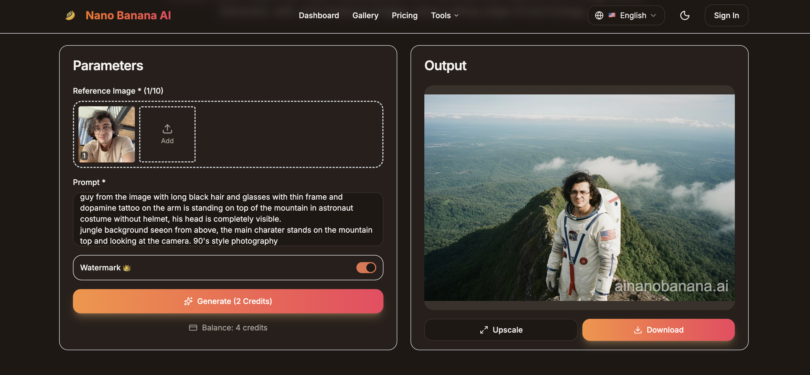
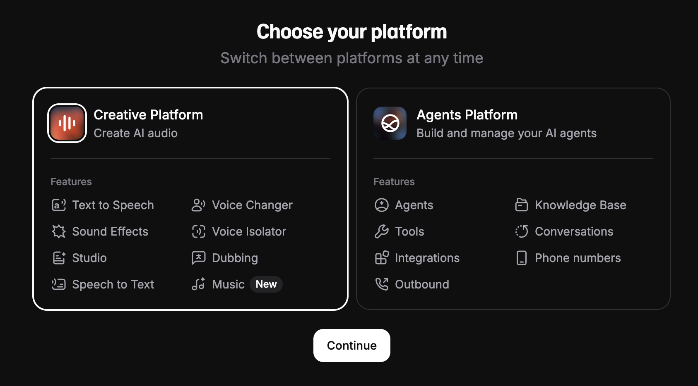

https://theresanaiforthat.com/ - AI მოდელების ბიბლიოთეკა, აქ იდება ხელოვნურური ინტელექტები დეტალური აღწერით, ბევრი მოდელი შექმნილია მოყვარულების მიერ და შესაბამისად მათი ხარისხიც დაბალია, თუმცა შესაძლებელია კარგი, გამოსადეგი საიტების პოვნაც. 

საუკეთესო სურათების გენერატორი:
Nano Banana AI:

მისი ცდა უფასოდ აქ შეგიძლიათ:
" https://ainanobanana.ai/?utm_source=google_ads&utm_campaign=nano-convension&utm_term=nano%20banana&gad_source=1&gad_campaignid=22935435342&gbraid=0AAAAA9-riKifKRumwt1ja9uafvsOkPp3d&gclid=Cj0KCQjwn8XFBhCxARIsAMyH8BuKFXK7rVbRJ4C1CjjT2ghf-4tkUFp1qrRw4a4yR--kNdYPJkT0u8IaAromEALw_wcB "

https://youtubetotranscript.com/

ამ საიტით შეგიძლიათ ნებისმიერი ინგლისური youtube-ვიდეოდან ტექსტის ამოღება. ტექსტი შეგიძლიათ chatGPT-ს საშუალებით თარგმნოთ, ჰალუცინაციების თავიდან არიდების მიზნით, გირჩევთ თარგმნისას ძალიან ბევრი ტექსტი ერთად არ მისცეთ, 200-300 სიტყვა ან ვიდეოს მხოლოდ ერთი "ნაწილი", აუხსენით ვიდეოს კონტექსტი.

ხელოვნური ინტელექტის არქიტექტურების ძალიან კარგი ვიზუალიზაციები და დეტალური აღწერა:
https://bbycroft.net/llm

ხმის გენერირება ხელოვნური ინტელექტით:
https://elevenlabs.io/

როდესაც გაივლით რეგისტრაციას პირველი არჩევანია:

agent = თუ გსურთ ზარების ავტომატიზაცია, ხელოვნური ინტელექტის აგენტი ხელსაწყოებით რომელიც საშუალებას აძლევენ გარემოსთან იმუშაონ მაგალითად ექსელი გამოიყენონ, ზარებს უპასუხონ და ა.შ

Creative = თუ გსურთ ვიდეოს გახმოვანება ან ნებისმიერი კრეატიული მიზნისთვის გენერირება. 
