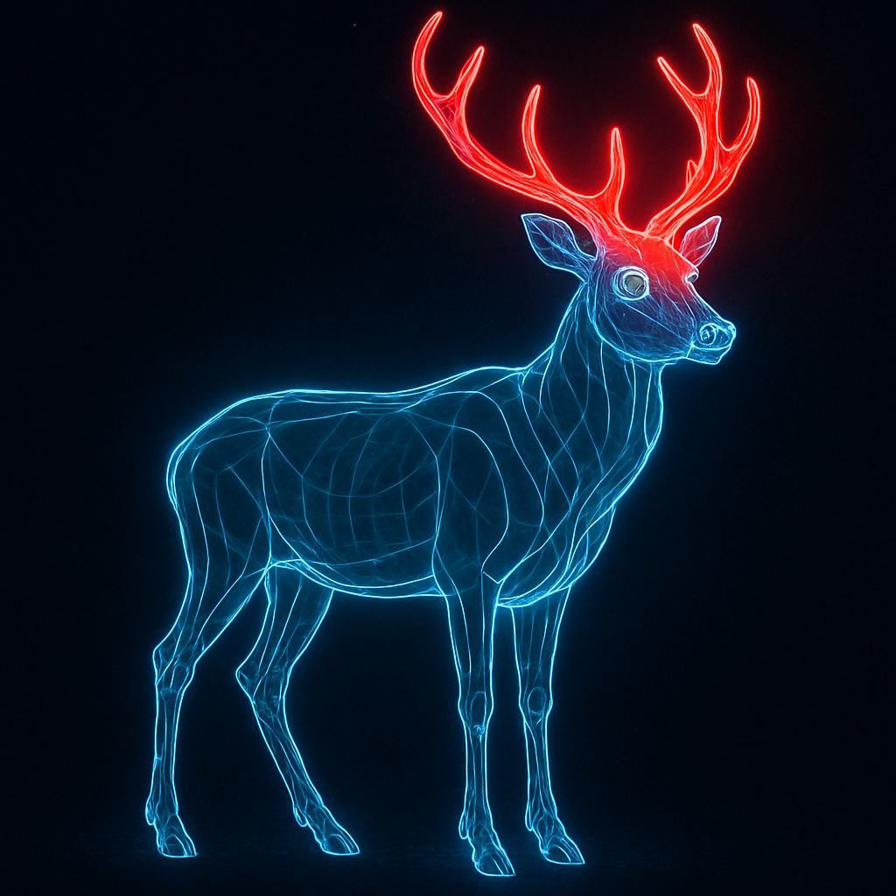
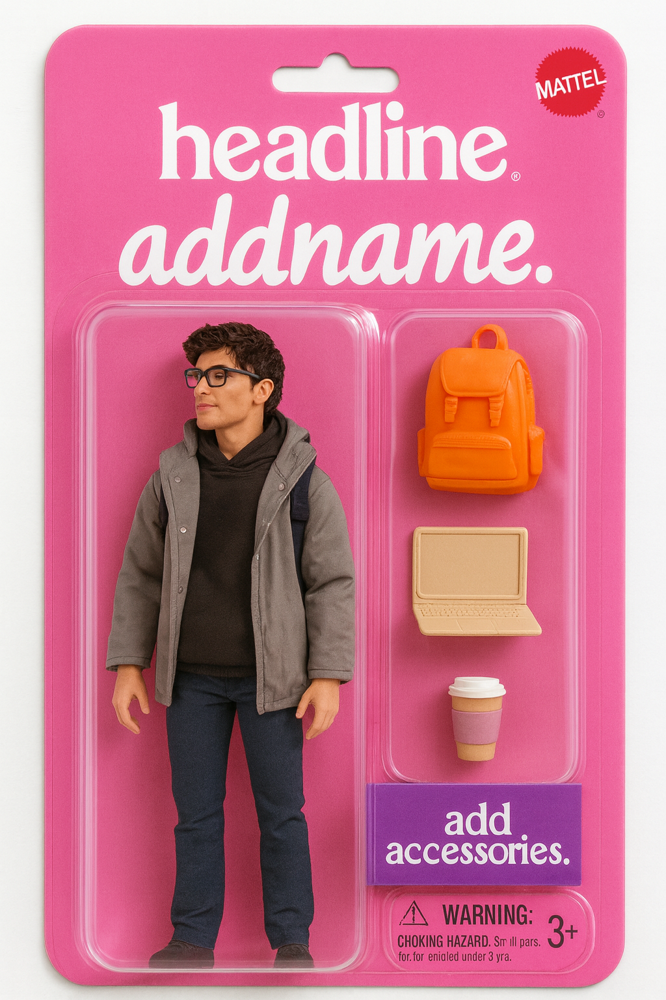
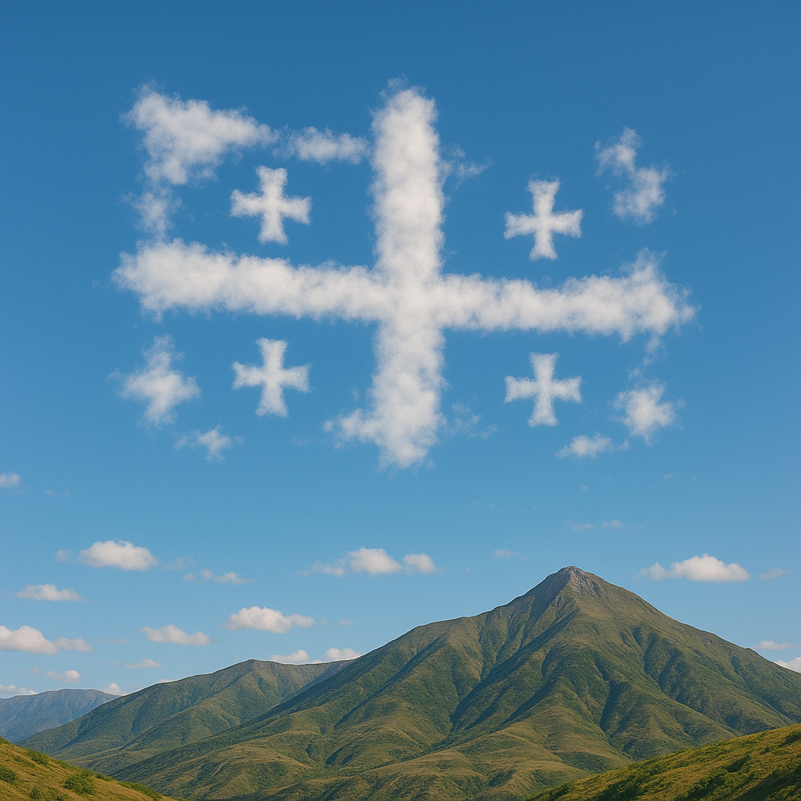
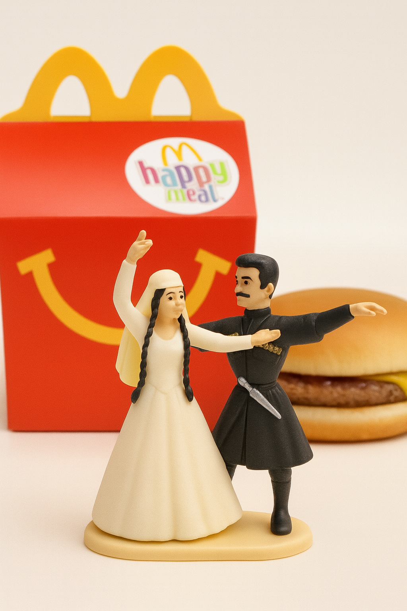
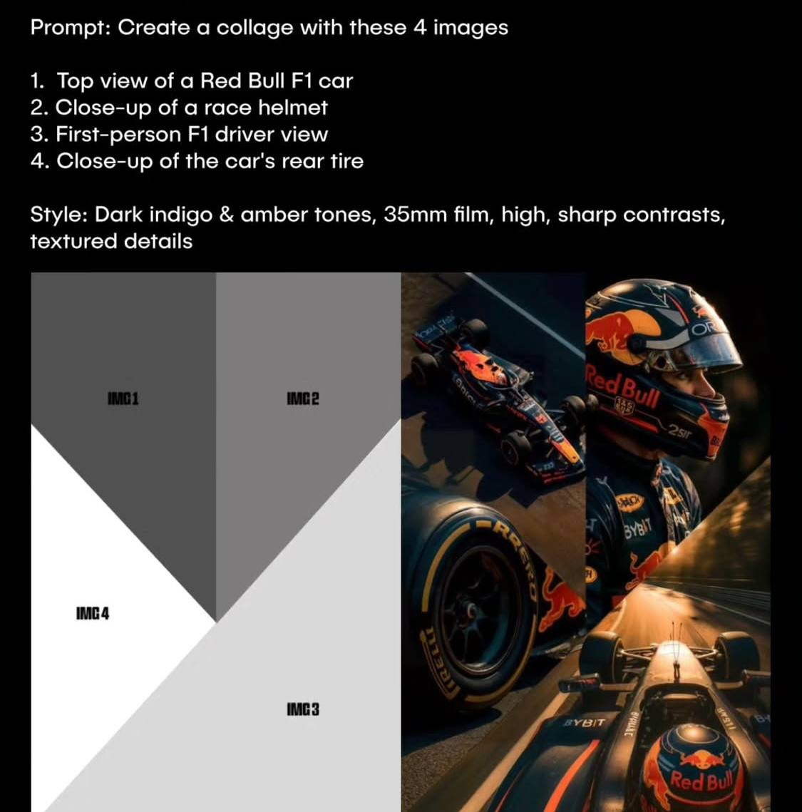
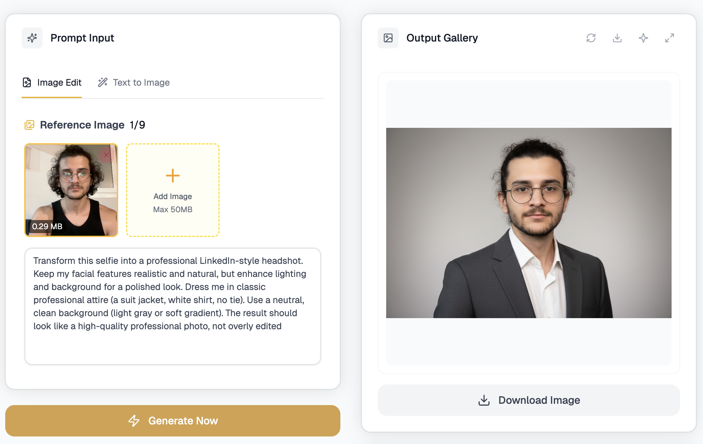

პრომპტის წერა ახალბედა თანამშრომელთან საუბარს გავს, იმისათვის რომ საქმეში საუკეთესო შედეგი მივიღოთ, საჭიროა კონტექსტის მიცემა და ზუსტი დავალებები, მაგრმა თუ ერთდროულად ზედმეტად ბევრ დავალებას მივცემთ ან კონტექსით უაზროდ გავტენით, მისი გაკეთებული საქმის ხარისხიც უფრო დაბალი იქნება. ამ ფაილში თქვენ ნახავთ სურათების და არა მარტო პრომპტებს, რომლებიც სხვა და სხვა სიტუაციებში შეიძლება გამოიყენოთ: საგანმანათლებლო ვიდეოებში, ექსელის ავტომატიზაციაში, სურათების გენერაციაში და ა.შ 

მზა პრომპტებს და მაგალითებს  ფაილის დაბლა იხილავთ, აქ კი პრომპტინგის ზოგად პრინციპებზე ვისაუბრებთ.

Prompt: A digital illustration of a [SUBJECT] outlined with bright blue lines over a dark background, highlighting its form. A specific [PART] glows red to indicate focus. Educational and visually striking, styled like advanced imaging

მაგალითად ავიღოთ ირემი და რქები -  Deer antlers
 

A digital illustration of a  Deer outlined with bright blue lines over a dark background, highlighting its form. A specific antlers glows red to indicate focus. Educational and visually striking, styled like advanced imaging

შექმენი შენი ბარბის სტილის სათამაშო ფიგურა ორი ნაბიჯით, ატვირთე შენი სურათი და გამოიყენე ეს პრომპტი:
"Draw a Barbie-style action figure of the person in this photo, inside a blister package.
Add the toy name 'add name' and the headline
'headline.' Include accessories like 'add accessories'

შევქმნათ ღრუბლებით ფიგურები და ტექსტი ნახატის გარშემო. აქ შესაძლებელია სურათის ატვირთვაც რათა ადგილი უფრო კარგად იყოს დაკოპირებული

A daytime photo capturing a [SUBJECT/OBJECT] formed by scattered clouds in the sky, positioned above a [PLACE]

რაც უფრო რთული ფორმის შექმნა გვსურს, მით უფრო მეტად "იბნევა" ხელოვნური ინტელექტი, საქართველოს და მთების ხსენებისას, ცაში შექმნილი საქართველოს დროშა პრიმიტიული იყო, ამიტომ პრომპტს სულ ოდნავ ვცვლი რათა უფრო ზუსტი შედეგი მივიღოთ

A daytime photo capturing a flag of Georgia, Sakartvelo formed by scattered clouds in the sky, positioned above a mountains. don't add phisical flag of georgia, create only could formed flag in the sky.

პრომპტი: Turn the uploaded image into a collectible toy figure, like those in a McDonald's Happy Meal. Style it as a small plastic figure with a McDonald's burger and packaging in the background. Use soft lighting, a clean backdrop

საშუალებას გვაძლევს ატვირთული სურათი მაკდონალდსის სათამაშოს სტილის ფიგურად ვაქციოთ

თუ გსურთ კოლაჟის გენერირება, აუტვირთეთ მარტივი სურათი სადაც წინასწარ აღწერილი იქნება თუ როგორი განლაგებით გსურთ კოლაჟის გამოყენება, დანომრეთ ან ფერებით განარჩიეთ კოლაჟის სხვადასხვა ნაწილები რათა თითოეულ მათგანში შეძლოთ სწორი სურათის გენერირება:

excel პრომპტების ბიბლიოთეკა:
https://www.geeksforgeeks.org/excel/hatgpt-prompts-to-boost-excel-productivity/

თუ გსურთ უბრალო სელფიდან პროფესიონალური პორტრეტის გაკეთება რეზიუმესთვის, გამოიყენეთ შემდეგი პრომპტი:

Transform this selfie into a professional LinkedIn-style headshot. Keep my facial features realistic and natural, but enhance lighting and background for a polished look. Dress me in classic professional attire (a suit jacket, white shirt, no tie). Use a neutral, clean background (light gray or soft gradient). The result should look like a high-quality professional photo, not overly edited

განსაკუთრებით კარგად მუშაობს nano banana AI-ზე

https://nanobanana.ai/generator

